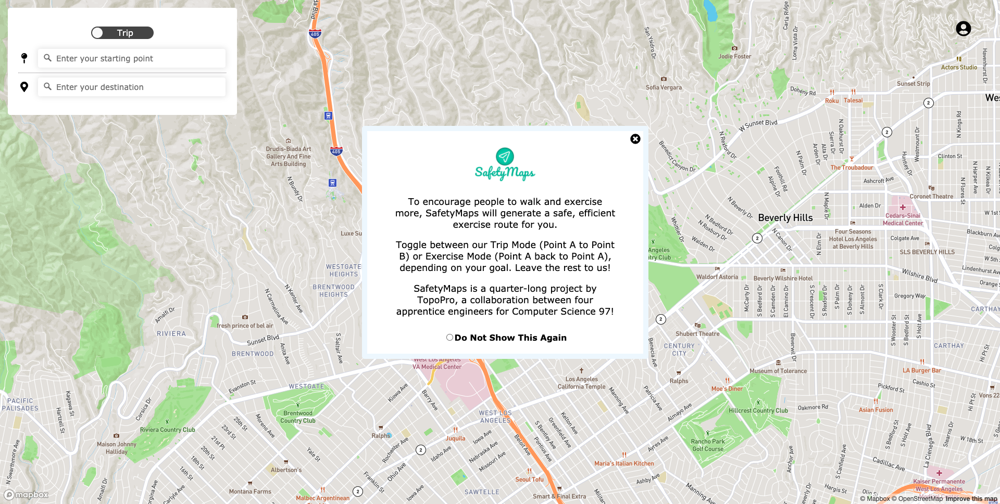
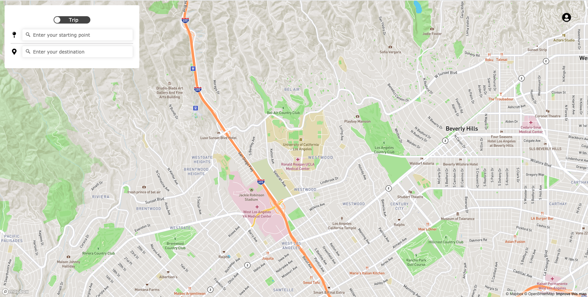

# Safety Maps
[SafetyMaps](https://github.com/evazhog/safety-maps) is an innovative web-based map application that lets a user generate routes optimized for both distance and safety. We provide two routing options: trip mode, which allows the user to choose a start and end point, and exercise mode, which allows the user to generate a circular path that takes them back to their start point. For their convenience, users may save their favorite routes, view recent routes, and recreate a route they went on before. They can also save their exercise times to keep track of their current and best walking, running, and biking speeds.

## Authors

[Rishi Sankar](https://github.com/rishisankar), [David Deng](https://github.com/daviddeng8), [Evan Zhong](https://github.com/evazhog), [Ray Huang](https://github.com/ray-cj-huang)

## Running the Application

Follow these instructions to get our project running on your local machine. If you run into any issues while setting up the project, feel free to email our team at SafetyMapsTopoPro@gmail.com.

### Prerequisites
To run this project, you'll need the following programs installed. To install Docker, we recommend you install [Docker Desktop Community Edition](https://www.docker.com/products/docker-desktop).
* Node Package Manager (NPM): v16.14.5
* Docker v19.03.9
* Docker-compose v1.25.5

Note: the above versions have been tested by us to work. However, our project will likely work on similar versions as well.

### Running the Server
To run our server, first navigate into the server directory.
```
cd ./server
```
Next, you will need to set up the Node environment variables. Create a file called `.env` in the server directory with the following contents:
```
DB_USER=myusername
DB_PASS=mypassword
DB_HOST=myhost
DB_DATA_COLLECTION=mycollection
JWT_SECRET_KEY=secret_string
COOKIE_PARSER_SECRET_KEY=secret_string_2
```
* Replace `myusername`, `mypassword`, `myhost` with MongoDB Atlas account information for the databases where all your data is stored. 
* Your data should be in a collection inside a database named data - replace `mycollection` with the name of that collection. 
* Finally, `secret_string` and `secret_string_2` should be randomly-generated strings containing letters, numbers, and special characters that will be used in encrypting account authorization tokens.

**Note to CS97 graders: we will include a working `.env` file in our tarball submission, so you may skip the above step.**  
**In addition, we have created the following demo user with some saved route history in the database our included `.env` references:**
```
Username: CS97SafetyMapsDemo@gmail.com
Password: gitgoodatsoftware
```

Next, to run the server, run the following command in the server directory:
```
docker-compose up
```
We use Docker to containerize our Node.js and Redis instances. Docker will handle all NPM package installation and Redis database configuration for you. To confirm the server is fully up and running, wait until you see the following log messages from the safety-maps-backend container:
```
safety-maps-backend_1  | [SafetyMaps] Server started!
safety-maps-backend_1  | [Redis] Connected!
safety-maps-backend_1  | [MongoDB] Connected to route database!
safety-maps-backend_1  | [Router] Data processed!
safety-maps-backend_1  | [Redis Router] Data Loaded into Redis Memory!
```

### Running the Client
Our web client is written using [React](https://reactjs.org/). First navigate into the client directory.
```
cd ./client
```
Then, to install the necessary packages and run the client, 
```
npm install
npm start
```
Note: ensure that the server is running first (and all five above long messages have been outputted), or most client functionality will not work.

If you succesfully start both the server and client and this is your first time running the app, you should see the following UI:

The Map should be centered on the UCLA campus:

Note the login icon on the upper righthand corner of the screen. If this is missing, it is likely a problem with your server, as the login components will not render unless the client successfully connects to the server.

## Loading Routing Geo-coordinates

All of the scripts related to data generation can be found in the `/data` subdirectory, which is separate from the `/client` and `/server`. The python scripts in `/data` are not invoked when running the client nor the server but are useful in generating the data to load into MongoDB.

### Accessing Map Data

We have created and provided a dataset of map data comprised of regions in the Los Angeles area centered around UCLA, including Westwood, Bel-Air, Santa Monica, West LA and Hollywood, with included safety information sourced from [LA Open Data](https://data.lacity.org/A-Safe-City/Crime-Data-from-2010-to-2019/63jg-8b9z). For navigation within Los Angeles, this dataset should be sufficient. However, if you wish to configure this project for a different region, see the Data Generation section for instructions on generating a new dataset. 

### Data Generation

The data we used for custom routing combines the LA Open Data and the Open Street Map data. 

If you want to try using a different set of data, the first step would be to use [OpenStreetMap](openstreetmap.org) and export data directly, if the dataset is small. If not, then the [Overpass API](http://www.overpass-api.de/query_form.html) would be a good tool to extract larger blocks of Open Street Mapdata in XML form, given a query with bounds on latitude and longitude. The first OpenStreetMap link will still serve as a valuable resource to find the bounding coordinates for the region you wish to test. 

From there, the command line program [osm2pgsql](https://wiki.openstreetmap.org/wiki/Osm2pgsql) will convert the XML file into an accessibly SQL database in your local Postgres database, which has to be running at the time of the command's execution. A sample usage of osm2pgsql is as follows:

```
osm2pgsql -cGs -d osm map.osm 
```

In the above, osm is the name of the database, the -c means to overwrite existing entries in the database, the -G creates geomtric objects, and the -s stores data within the database throughout the upload process as opposed to one atomic store (helpful if you lack RAM). 

Unfortunately, there is no central repository for open source crime data, but whatever method you choose to get the data should return the data in a Pandas dataframe. For the location data, make sure to change the database locations in `location_data.py` in order for the script to work. 

The script `pickling.py` should generate two pickle files, one of the crime data, and one of the location data. You may want to comment out part of the code for the file, since it would take a decent amount of time to run otherwise. The script `merging_data.py` will merge the two resulting pickle files and return another Pandas dataframe– again, make sure to configure the script to local destinations on your computer. Afterwards, `upload_data.py` will suffice to adding the combined location and crime data to MongoDB for usage in the application. 

## Acknowledgments

* Paul Eggert and the TAs/LAs of UCLA CS 97
* [Mapbox](http://mapbox.com/)'s visualization tools and directions API
